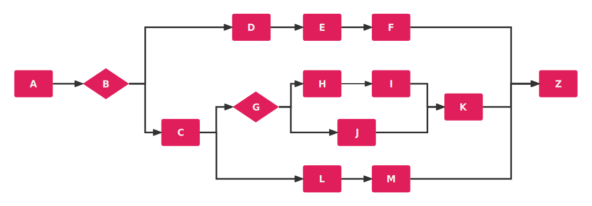
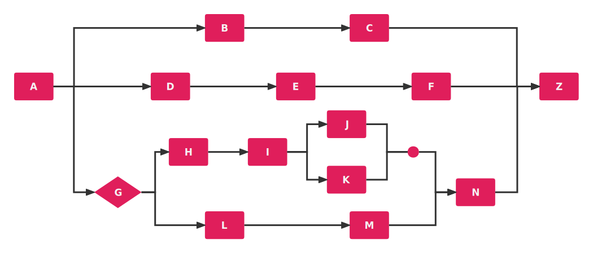
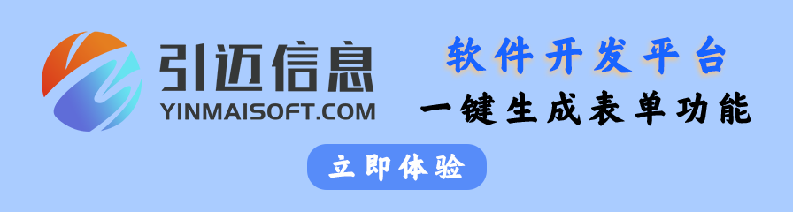
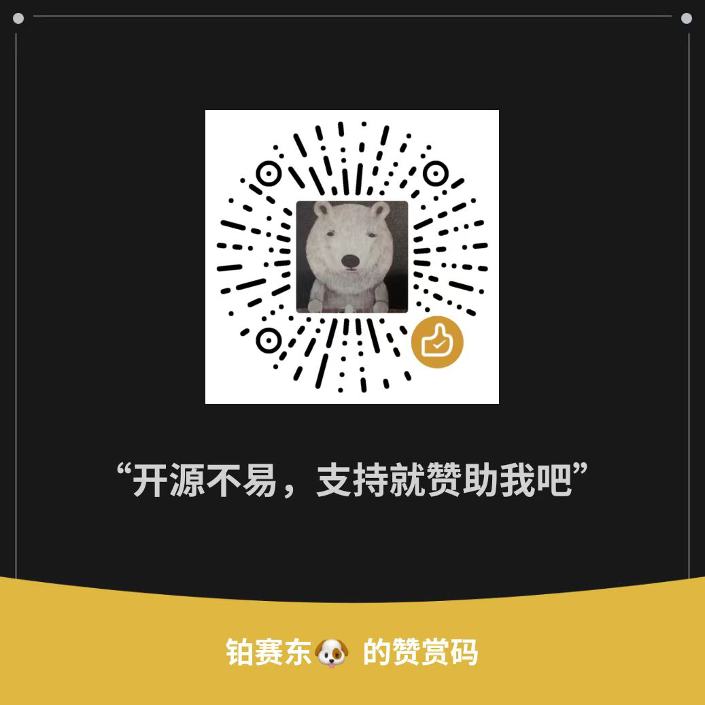

[中文](README.zh-CN.md)

<h3>Your star is my motivation to keep going. If you like LiteFlow, please help me with a star in the upper right corner.</h3>

## Overview
LiteFlow is a lightweight and powerful rules engine framework, which can be used in the field of complex componenzed business orchestration. DSL rules drive the whole complex business, and can achieve smooth refresh hot deployment, supporting the embedding of multiple scripting language rules. Help the system become more silky and flexible.

LiteFlow was officially open-sourced in 2020 and has since become an indispensable presence in the field of open-source rule engines in China. What's more, the most crucial aspect is that LiteFlow is an open-source project that continues to iterate at a high speed.

LiteFlow is a community-driven project. We take community building very seriously. We have a community of more than 4000 users who can respond to any problems or suggestions they encounter.

You can find out how to join the community on the official website!

## Website url: [Click here to access the official website](https://liteflow.cc)
## Documents url: [Click here to enter the documentation to learn](https://liteflow.cc/pages/5816c5/)

## Feature
* **Component definition unified:** All logic is a component, for all logic to provide a unified component implementation, small size, large energy.
* **Rules lightweight:** based on the rules file to arrange the process, learning the rules entry only takes 5 minutes, a read both understand.
* **Rule diversification:** rules support XML, JSON, YML three rule file writing methods, which you like to use.
* **Arbitrary arrangement:** Synchronous asynchronous mixing, no matter how complex the logic process, using LiteFlow rules, are easy to do, see the rules file to see how the logic works.
* **Rules can be loaded from anywhere:** The framework provides implementations of local file configuration sources and ZK configuration sources, as well as an extension interface that allows you to store rules anywhere.
* **Elegant hot refresh mechanism:** Rule changes, instant change of application rules without restarting your application. High concurrency does not cause any errors in executing rules due to refreshing rules.
* **Wide support:** LiteFlow works regardless of whether your project is built on Springboot, Spring, or any other Java framework.
* **JDK support:** From JDK8 to JDK17. Don't worry about JDK versions.
* **Full Springboot support:** Supports Springboot 2.X through the latest Springboot 3.X.
* **Scripting language support:** You can define script language nodes that support Groovy, Javascript, QLExpress, Python, Lua, Kotlin and Aviator. More script languages will be supported in the future.
* **Rule nesting support:** You can use simple expressions to create multiple nested complex logic layouts if you want.
* **Component retry support:** Components can support retry, and each component can customize the retry configuration and specify exceptions.
* **Context isolation mechanism:** Reliable context isolation mechanism, you do not have to worry about high concurrency data flow.
* **Declarative component support:** You can make any of your classes become components in seconds.
* **Detailed step information:** How your link performs, how much time each component takes, what errors are reported at a glance.
* **Stable and reliable:** has been iterating for more than 2 years, running stably on the core systems of major companies.
* **Excellent performance:** the framework itself consumes little extra performance, depending on the efficiency of your component execution.
* **Built-in simple monitoring:** Built-in a command line monitoring framework, you can know the running time ranking of each component.

## What scenarios apply

LiteFlow is a choreographed rules engine that is best at decoupling your systems. If you have a complex system with bloated code, the LiteFlow framework is a great solution.

LiteFlow uses regular expressions to drive the engine that you define. Have you ever thought about how to write multithreaded process choreography like the following?

These processes can be easily solved with LiteFlow! The framework has a very low threshold to learn the expression language, but it can accomplish extremely high complexity of the choreography.

LiteFlow has an extremely detailed and easy-to-understand documentation， it can help you solve more than 95% of your problems when using the framework.

LiteFlow has 2000 test cases and more. Complete documentation and comprehensive test case coverage guarantee the stability of LiteFlow framework!

Looking forward to your use！

**DISCORD LINK**

Discord Link: [https://discord.gg/MpdBSBnFTu](https://discord.gg/MpdBSBnFTu)

## 👑LF CLUB Community

LF CLUB is a premium paid community founded by the author of LiteFlow.

LF CLUB can help all users of the LiteFlow framework, as well as potential developers who want to use LiteFlow.

LF CLUB provides the following services:

**1.Weekly releases of a condensed analysis series for LF. As long as users study along with the Planet series articles, they will definitely be able to fully grasp LF.**

**2.Provide a Q&A service where members can ask unlimited questions and receive detailed replies and guidance on the same day.**

**3.Each enrolled user is entitled to two remote one-on-one tutoring sessions per year as part of the remote assistance service.**

**4.Every 1 to 2 days, there will be updates on LF's current progress and the focus of the next version.**

The LF CLUB can solve all the problems you encounter when using the LiteFlow framework. It offers a series of courses to help you gain a deep understanding of the LiteFlow framework. Unlike the WeChat community, the LF CLUB prioritizes the importance of questions and provides detailed answers.

Exclusive content helps you gain a profound understanding without the need to search for answers on other platforms. The author personally teaches, providing expert guidance at your fingertips, eliminating the need to seek help from others.

To join the LF CLUB, please scan the QR code below or click on the image to go directly to the website.

## 🦾Sponsor

**MISBoot低代码开发平台**

**云程企业级低代码平台**

**驰骋工作流引擎**

**FastBee物联网平台**

**JNPF低代码开发平台**

**速众 AI 低代码开发平台**

**WECHAT OFFICIAL ACCOUNT**

Since the community group is over 200 people, you need to be invited to join the group. Follow the WECHAT OFFICIAL ACCOUNT and click `Personal WeChat` to add me, I can invite you into the group

Open source is not easy, please sponsor LiteFlow if you support it

