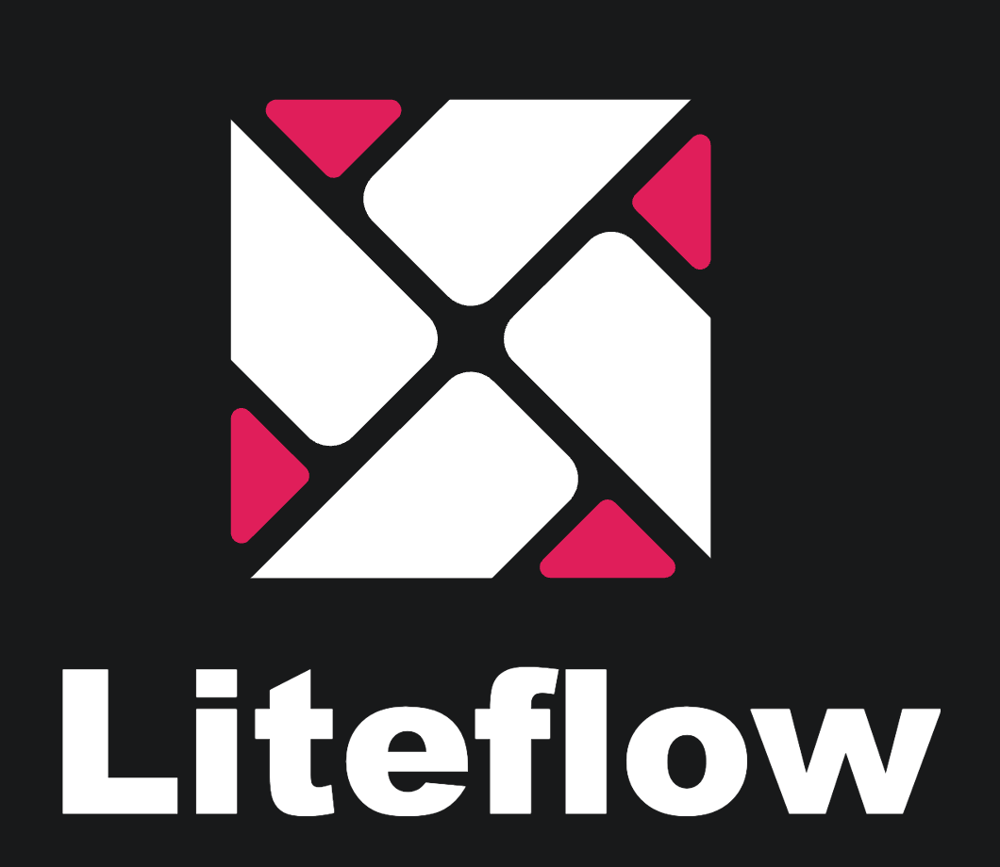

<h3>您的star是我继续前进的动力，如果喜欢请右上角帮忙点个star</h3>

## Gitee Star趋势图

## 贡献者列表
[

## 概述
liteFlow是一个轻量，快速的组件式流程引擎框架，组件编排，帮助解耦业务代码，让每一个业务片段都是一个组件，并支持热加载规则配置，实现即时修改。

## 项目主页请点击：[项目主页](http://yomahub.com/liteflow)
## 示例工程请点击：[示例工程](https://gitee.com/bryan31/liteflow-example)

## 特性
* 复杂业务的解耦利器，为所有组件提供统一的实现协议
* 基于规则文件来编排流程，并可进行热编排
* 框架中支持zookeeper流程配置，即时推送修改内容
* 能自由扩展配置持久化源，提供扩展接口
* 支持springboot的自动装配，也支持spring的配置和非spring的项目
* 提供串行和并行2种模式，提供常见常见的表达式语句
* 提供无级嵌套子流程模式
* 数据槽高并发隔离机制
* 自带简单的监控，能够知道每个组件的运行耗时排行

**微信公众号**

关注公众号回复`liteflow`即可加入讨论群

