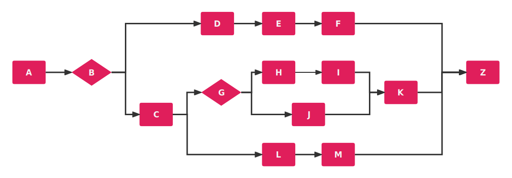
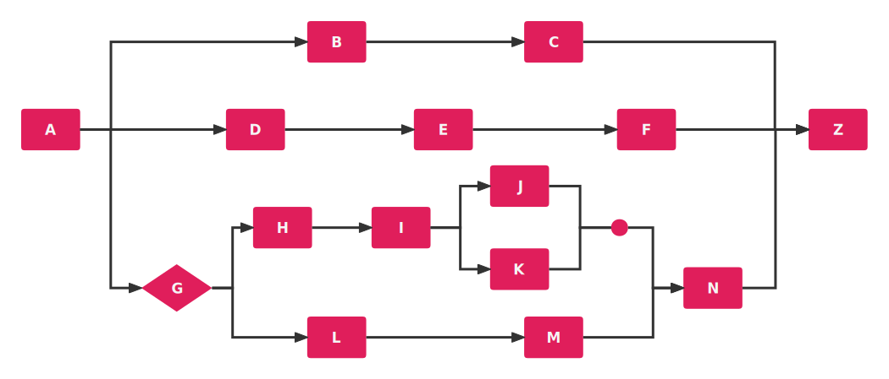
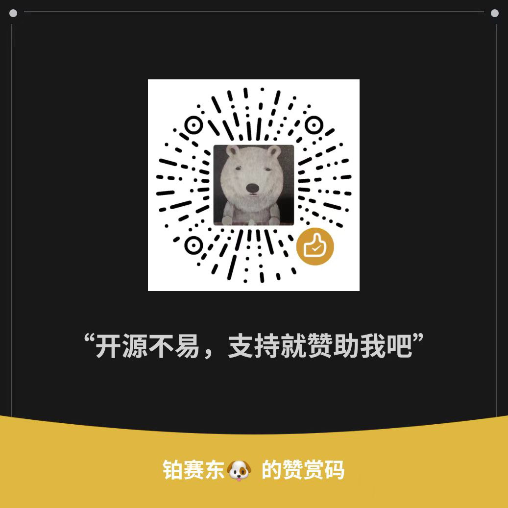

<p align="center">
<a href="https://liteflow.cc/">
    
</a>
</p>

[English](README.md)

<h3>您的star是我继续前进的动力，如果喜欢LiteFlow请右上角帮忙点个star</h3>

## 🌈概述
LiteFlow是一个非常强大的现代化的规则引擎框架，融合了编排特性和规则引擎的所有特性。它可用于复杂的组件化业务的编排领域，独有的DSL规则驱动整个复杂业务，并可实现平滑刷新热部署，支持多种脚本语言规则的嵌入。帮助系统变得更加丝滑且灵活。

LiteFlow于2020年正式开源，直到现在已经是国内开源规则引擎中不可忽视的存在，而且最关键的是，LiteFlow还是一个持续高速迭代的开源项目。

从 v2.16.0 起，LiteFlow 更是把 AI Agent 变成了可以被直接编排进规则的"一等公民"，让 AI 与你现有的业务节点平起平坐、自由编排。

LiteFlow是一个由社区驱动的项目，我们非常重视社区建设，拥有一个庞大的使用者社区，在使用中碰到任何问题或者建议都可以在社区中反应。

你在官网中可以找到加入社区的方式！

## 官网链接：[点这里进入官网](https://liteflow.cc/)
## 文档链接：[点这里进入文档进行学习](https://liteflow.cc/pages/5816c5/)

## 🍬特性
* **组件定义统一：** 所有的逻辑都是组件，为所有的逻辑提供统一化的组件实现方式，小身材，大能量。
* **规则轻量：** 基于规则文件来编排流程，学习规则入门只需要5分钟，一看即懂。
* **规则多样化：** 规则支持xml、json、yml三种规则文件写法方式，喜欢哪种用哪个。
* **任意编排：** 再复杂的逻辑过程，利用LiteFlow的规则，都是很容易做到的，看规则文件就能知道逻辑是如何运转的。
* **规则持久化：** 框架原生支持把规则存储在标准结构化数据库，Nacos，Etcd，Zookeeper，Apollo，Redis。您也可以自己扩展，把规则存储在任何地方。
* **优雅热刷新机制：** 规则变化，无需重启您的应用，即时改变应用的规则。高并发下不会因为刷新规则导致正在执行的规则有任何错乱。
* **支持广泛：** 不管你的项目是不是基于Spring Boot，Spring还是任何其他Java框架构建，LiteFlow都能游刃有余。
* **JDK支持：** 从JDK8到JDK25，统统支持。无需担心JDK版本。JDK21以上支持虚拟线程。
* **Spring Boot支持全面：** 支持Spring Boot 2.X、3.X，并已支持最新的Spring Boot 4.X。
* **脚本语言支持：** 可以定义脚本语言节点，支持Groovy，Java，Kotlin，JavaScript，QLExpress，Python，Lua，Aviator。未来还会支持更多的脚本语言。
* **脚本和Java全打通：** 所有脚本语言均可调用Java方法，甚至于可以引用任意的实例，在脚本中调用RPC也是支持的。
* **AI Agent编排：** 把一个完整的 ReAct Agent 封装成标准的 LiteFlow 组件，让 AI 直接被编排进你的业务规则。
* **规则嵌套支持：** 只要你想得出，你可以利用简单的表达式完成多重嵌套的复杂逻辑编排。
* **组件重试支持：** 组件可以支持重试，每个组件均可自定义重试配置和指定异常。
* **上下文隔离机制：** 可靠的上下文隔离机制，你无需担心高并发情况下的数据串流。
* **声明式组件支持：** 你可以让你的任意类秒变组件。
* **详细的步骤信息：** 你的链路如何执行的，每个组件耗时多少，报了什么错，一目了然。
* **稳定可靠：** 历时2年多的迭代，在各大公司的核心系统上稳定运行。
* **性能卓越：** 框架本身几乎不消耗额外性能，性能取决于你的组件执行效率。
* **自带简单监控：** 框架内自带一个命令行的监控，能够知道每个组件的运行耗时排行。

## ☘️什么场景适用

LiteFlow是一款编排式的规则引擎，最擅长去解耦你的系统，如果你的系统业务复杂，并且代码臃肿不堪，那LiteFlow框架会是一个非常好的解决方案。

LiteFlow利用规则表达式为驱动引擎，去驱动你定义的组件。你有想过类似以下的多线程流程编排该如何写吗？




这一切利用LiteFlow轻而易举！框架的表达式语言学习门槛很低，但是却可以完成超高复杂度的编排。

LiteFlow拥有极其详细易懂的文档体系，能帮助你解决在使用框架的时候95%以上的问题。

目前为止，LiteFlow拥有2000多个测试用例，并且不断在增加中。完备的文档+覆盖全面的测试用例保障了LiteFlow框架的稳定性！

LiteFlow期待你的了解！

## 🤖AI Agent编排（v2.16.0 全新特性）

从 v2.16.0 起，LiteFlow 拥有了自己的 AI Agent 模块 `liteflow-react-agent`。

它做的不是简单的"大模型组件"，而是把一个完整的 **ReAct（Reasoning + Acting）Agent** 封装成标准的 LiteFlow 组件——**一个组件，就是一个 Agent**。你只需声明一个组件、实现几个简单的方法，对接大模型、多轮会话记忆、Skills 技能体系这些能力，模块都替你包揽好了。

而一旦 Agent 变成了 LiteFlow 组件，它就自动继承了 LiteFlow 的全套编排能力。你原来怎么写规则，现在还怎么写，只不过其中某个节点，是一个会思考的 AI：

```
// 串行编排，AI 节点自然地夹在业务节点中间
THEN(prepare, deepseekAgent, recordReply);

// 让两个不同的大模型并行分析同一个问题
WHEN(deepseekAgent, qwenAgent);

// 根据条件路由到不同的 Agent
IF(isMath, mathAgent, deepseekAgent);

// 多 Agent 协同：并行分析 + 汇总决策
THEN(prepare, WHEN(analyzerAgent, riskAgent), summaryAgent, notify);
```

这里的 `THEN`、`WHEN`、`IF`、`SWITCH`、`FOR` 没有一个是为 AI 新造的，全是 LiteFlow 用了多年的编排算子。**你会编排 LiteFlow，你就会编排 AI。**

该模块对接了主流大模型平台：OpenAI、Claude、Gemini、DeepSeek、通义千问（DashScope）、Kimi、GLM 等，并提供多轮会话记忆、Skills 技能体系、工作空间文件工具、流式输出等能力，换模型基本就是换一行 `model()` 的事。

> 提示：AI Agent 模块基于 agentscope-java，运行时需要 JDK 21+。完整使用方式请查阅[官方文档](https://liteflow.cc/)。

## 👑LF CLUB社区

LF CLUB是由LiteFlow作者创办的高级付费社区

LF CLUB能帮助到所有LiteFlow框架的使用者，以及想使用LiteFlow的潜在开发者。

LF CLUB提供以下服务：

**1.持续连载的LF解析精华系列。从头开始解析LF，只要跟着星球解析系列走，使用者一定能完全掌握LF。**

**2.提供答疑服务，会员可以无限制提问，当天必定得到详细的回复和指导建议。**

**3.第一时间分享LF目前的进度，以及下一个版本的重点。**


LF CLUB里能解决你在使用LiteFlow框架时碰到的所有问题，并有系列课程能帮助你深刻理解LiteFlow框架，不同于微信社区，LF CLUB的问题优先级程度是最高的，且答疑非常详细。

独家内容帮助深刻理解，不用在其他平台去搜索问题的答案。作者亲授，相当于随时拥有专家在身边，不用再去求助其他人。

加入LF CLUB，请扫描以下二维码，或者直接点击图片也可以直达：

<a href="https://t.zsxq.com/16jLy4Bj6"></a>

## 🦾赞助商

**驰骋工作流引擎**

<a href="https://ccbpm.cn/?frm=liteFlow"></a>

**FastBee物联网平台**

<a href="https://fastbee.cn/"></a>

**速众 AI 低代码开发平台**

<a href="https://www.suconnect.com?hmsr=LiteFlow&hmpl=&hmcu=LiteFlow&hmkw=&hmci="></a>

**Easysearch**

<a href="https://easysearch.cn/"></a>

**SX.ORG**

<a href="https://sx.org/?c=lite"></a>

**微信公众号**

社区群需要邀请入群。关注公众号后点击`个人微信`加我，我可以拉你入群


开源不易，支持就请赞助LiteFlow，请我喝一杯咖啡吧


