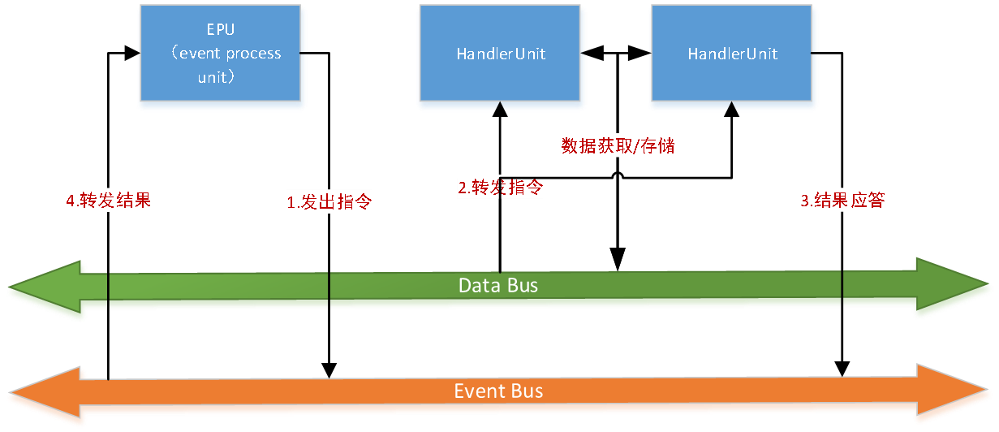

# 一、快速开始
liteflow需要你的项目使用maven
## 1.1依赖
```xml
<dependency>
	<groupId>com.thebeastshop.liteflow</groupId>
	<artifactId>liteflow</artifactId>
	<version>${liteFlow.version}</version>
</dependency>
```
## 1.2流程配置文件
```xml
<?xml version="1.0" encoding="UTF-8"?>
<flow>
	<nodes>
		<node id="a" class="com.thebeastshop.liteflow.test.component.AComponent"/>
		<node id="b" class="com.thebeastshop.liteflow.test.component.BComponent"/>
		<node id="c" class="com.thebeastshop.liteflow.test.component.CComponent"/>
		<node id="d" class="com.thebeastshop.liteflow.test.component.DComponent"/>
		<node id="e" class="com.thebeastshop.liteflow.test.component.EComponent"/>
	</nodes>
	
	<chain name="demoChain">
		<then value="a,b,c"/> <!-- then表示串行 -->
		<when value="d,e"/> <!-- when表示并行 -->
	</chain>
</flow>
```

component为组件，这里你需要实现这些组件，每个组件继承`NodeComponent`类
```java
public class AComponent extends NodeComponent {

	@Override
	public void process() {
		String str = this.getSlot().getRequestData();
		System.out.println(str);
		System.out.println("Acomponent executed!");
	}
}
```

chain为流程链，每个链上可配置多个组件节点。目前执行的模式分串行和并行2种。
串行标签为`then`，并行标签为`when`。
在串行的模式下，以下2种写法是等价的,可以根据业务需要来把不同种类的节点放一行里。
```xml
<then value="a,b,c,d"/>
```
```xml
<then value="a,b"/>
<then value="c,d"/>
```

## 1.3执行流程链
```java
FlowExecutor executor = new FlowExecutor();
executor.setRulePath(Arrays.asList(new String[]{"/config/flow.xml"}));
executor.init();
Slot slot = executor.execute("demoChain", "arg");
```

如果你的项目使用spring，推荐参考[和Spring进行集成](http://123.206.92.144:3000/guide_cn?id=和spring进行集成)

# 二、和spring进行集成
## 2.1流程配置可以省略的部分
流程配置中的`nodes`节点，可以不用配置了，支持spring的自动扫描方式。你需要在你的spring配置文件中定义
```xml
<context:component-scan base-package="com.thebeastshop.liteflow.test.component" />
<bean class="com.thebeastshop.liteflow.spring.ComponentScaner"/>
```

当然，你的组件节点也需要注册进spirng容器
```java
@Component("a")
public class AComponent extends NodeComponent 
	@Override
	public void process() {
		String str = this.getSlot().getRequestData();
		System.out.println(str);
		System.out.println("Acomponent executed!");
	}
}
```

## 2.2spring中执行器的配置
```xml
<bean id="flowExecutor" class="com.thebeastshop.liteflow.core.FlowExecutor">
	<property name="rulePath">
		<list>
			<value>/config/flow.xml</value>
		</list>
	</property>
</bean>
```
然后你的项目中通过spring拿到执行器进行调用流程。

# 三、和zookeeper进行集成
## 3.1spring配置
liteFlow支持把配置放在zk集群中，并支持实时修改流程
你只需在原来配置执行器的地方，把本地xml路径换成zk地址就ok了
```xml
<!-- 这种是zk方式配置 -->
<bean id="flowExecutor" class="com.thebeastshop.liteflow.core.FlowExecutor">
	<property name="rulePath">
		<list>
			<value>127.0.0.1:2181,127.0.0.1:2182,127.0.0.1:2183</value>
		</list>
	</property>
	<!--这个不配置就用默认的/lite-flow/flow节点 -->
	<property name="zkNode" value="/lite-flow/customFlow"/>
</bean>
```

如果你不加zkNode这个标签，就用默认的节点路径进行读取配置。
使用这种方式加载配置，在zk上进行更改配置。liteFlow会实时刷新配置。

# 四、使用自定义的配置源
## 4.1创建自定义配置源的类
如果你不想用本地的配置，也不打算使用zk作为配置持久化工具。liteFlow支持自定义的配置源的扩展点。
在你的项目中创建一个类继承`ClassXmlFlowParser`这个类
```java
public class TestCustomParser extends ClassXmlFlowParser {

	@Override
	public String parseCustom() {
		System.out.println("进入自定义parser");
		String xmlContent = null;
		//这里需要自己扩展从自定义的地方获取配置
		return xmlContent;
	}
}
```

## 4.2spring配置
spring中需要改的地方还是执行器的配置，只需要在配置的路径地方放入自定义类的类路径即可
```xml
<bean id="flowExecutor" class="com.thebeastshop.liteflow.core.FlowExecutor">
	<property name="rulePath">
		<list>
			<value>com.thebeastshop.liteflow.test.TestCustomParser</value>
		</list>
	</property>
</bean>
```

# 五、架构设计
## 5.1组件式流程引擎架构设计

Handler Unit：我们想象成每一个业务都是一个业务组件，每一个业务组件就是一个handlerUnit（处理单元）
EPU：这里的epu对应的就是我们的执行器，用来统筹并处理handlerUnit。相当于计算机的CPU
Event Bus：事件总线，用来指定下一个命令是什么，该如何去执行处理单元。这里的时间总线由我们的配置构成
Data Bus：数据总线，用来存储整个调用链里数据。每一个请求生成一个数据槽。一个数据里最多有1024个数据槽。

# 六、接入详细指南
## 6.1执行器
执行器`FlowExecutor`用来执行一个流程，用法为
```java
public <T extends Slot> T execute(String chainId,Object param);
```
第一个参数为流程ID，第二个参数为流程入参
返回为`Slot`接口的子类，以上方法所返回的为默认的实现类`DefaultSlot`

?> 实际在使用时，并不推荐用默认的`DefaultSlot`，推荐自己新建一个类继承`AbsSlot`类
推荐使用带自定义Slot的执行接口：
```java
public <T extends Slot> T execute(String chainId,Object param,Class<? extends Slot> slotClazz);
```

关于`Slot`的说明，请参照[数据槽](http://123.206.92.144:3000/#/guide?id=数据槽)

## 6.2数据槽
数据槽