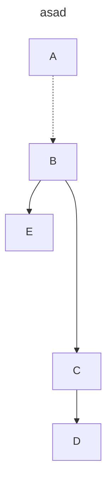

## UPGRADE mermaid version in idea markdown plugin

1. execute command
```cmd
npm i mermaid
```
2. find latest mermaid.js under .\node_modules\mermaid\dist

3. replace mermaid.js in
C:\Users\LX\AppData\Local\JetBrains\IdeaIC2022.3\markdown\download\mermaidlanguageextension\mermaid

