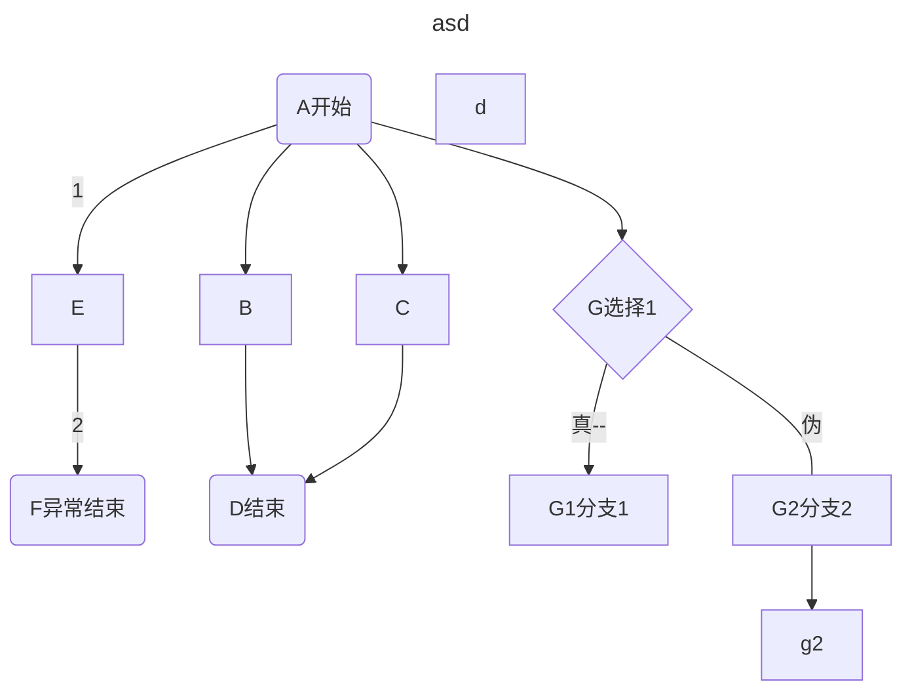

# 说明
### sub 说明

```mermaid
--- 


title: asd


---


flowchart TD;
    A(A开始)
    -->
    B;

A --1--> E -->       |2| F(F异常结束)
    A-->C;
    B-->D(D结束);
    C-->D;
    A-->G{G选择1};
    G -->|真--| G1[G1分支1];
    G -- 伪 --- G2[G2分支2] --> g2;
    d
```