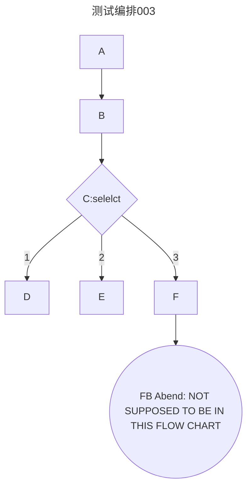
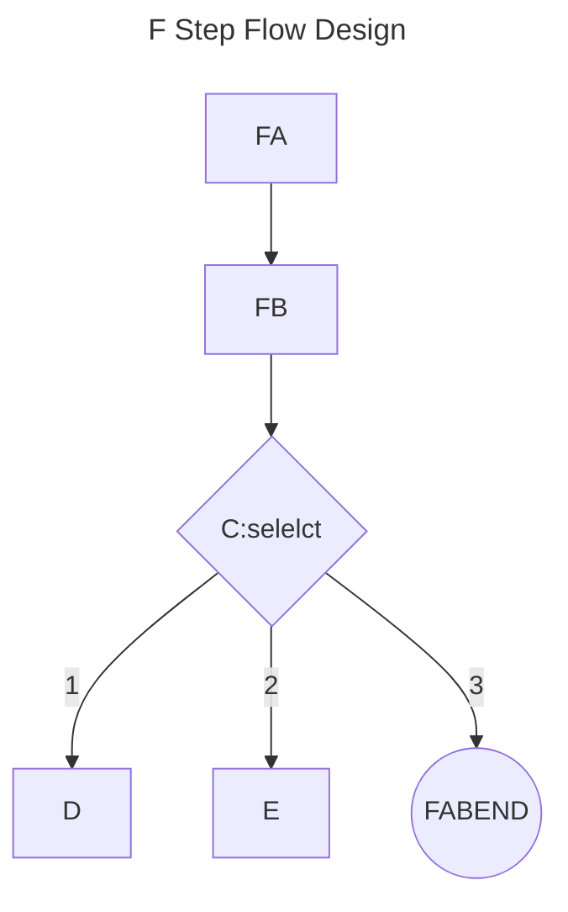

```mermaid
--- 
title: 测试编排003
---
flowchart TD;
A --> B --> C{C:selelct}
C --> |1| D
C -->|2| E 
C -->|3| F --> FB((FB Abend: NOT SUPPOSED TO BE IN THIS FLOW CHART)) 


```

```mermaid
--- 
title: F Step Flow Design
---
flowchart TD;
FA --> FB --> FC{C:selelct}
FC --> |1| D
FC -->|2| E 
FC -->|3| FABEND((FABEND)) 


```